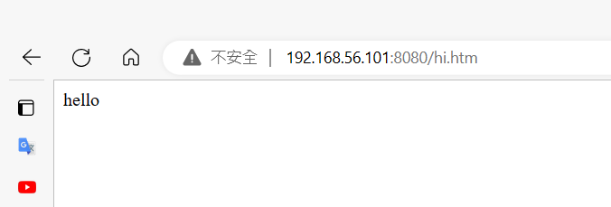

[Install Docker Engine on CentOS](https://docs.docker.com/engine/install/centos/)

[docker容器的隔离性 (codeplayer.org)](https://www.codeplayer.org/Wiki/Computer-Science/docker/docker容器的隔离性.html)


## program vs process

program store in disk

process is program in run


## Image vs container

difference is as same as difference between image and container

image store in somewhere

container is the image running

and on image can create multiple container

## Docker

is stack of images running


however only the image on top of the stack can be overwrite others below are readonly.

same concept goes to overriding, the upper images can override the lower images.


changes are done, no image are saved. Then next time the docker start running, all the changes are gone. 

Because  docker run stack of images

---

### LXC

---

### AUFS

---

### Docker path

`repository/owner/name/tag`

---

### Port binding

In order to interact with docker

bind the docker with the host by port 

For example, docker run a httpd service on 80 port, then host use 8080 port to communicate with docker in 80 port

`-p HOSTPORT:DOCKERPOS` :ex: `docker run -d -p 8080:80 centos:web /usr/sbin/apachectl -D FOREGROUND`

However before binding,  we need to check if port is occupied by around service.

`netstat -tunlp | grep 8080`

>  result

```bash
[root@centos7-1 z22756392z]# netstat -tunlp | grep 8080
[root@centos7-1 z22756392z]# docker run -d -p 8080:80 centos:web /usr/sbin/apachectl -D FOREGROUND
10aa0a50eaeadbcd3e05a42514e0fa1a0e6f3b70b3595934f4bde0827455d372
[root@centos7-1 z22756392z]# docker ps
CONTAINER ID   IMAGE        COMMAND                  CREATED         STATUS         PORTS                                   NAMES
10aa0a50eaea   centos:web   "/usr/sbin/apachectl…"   5 seconds ago   Up 4 seconds   0.0.0.0:8080->80/tcp, :::8080->80/tcp   ecstatic_einstein
```

---

### Modify docker file

#### Enter in run

`docker exec -it CONTAINERNAME bash`

> modify html

```bash
[root@centos7-1 z22756392z]# docker ps
CONTAINER ID   IMAGE        COMMAND                  CREATED          STATUS          PORTS                                   NAMES
10aa0a50eaea   centos:web   "/usr/sbin/apachectl…"   32 minutes ago   Up 32 minutes   0.0.0.0:8080->80/tcp, :::8080->80/tcp   ecstatic_einstein
[root@centos7-1 z22756392z]# docker exec -it 10a bash
[root@10aa0a50eaea /]# echo "hello" > /var/www/html/hi.htm
```



> Disadvantage

Once the docker exit, modified or created file won't be save

#### Docker Volume


using docker volumn command to let docker has exiting host directory 

```bash
[root@centos7-1 z22756392z]# cd myweb/
[root@centos7-1 myweb]# echo "hello" > hi.htm
[root@centos7-1 myweb]# pwd
/home/z22756392z/myweb
[root@centos7-1 myweb]# docker run -d -p 8080:80 -v /home/z22756392z/myweb:/var/www/html --name web1 centos:web /usr/sbin/apachectl -D FOREGROUND
2c192c53a002022b1bca1e0efa41b153f84aabe3e3b26d64a03bc054ae9f3505
```

* `-d `: run in background

* `-p 8080:80`: bind host 8080 port to docker 80 port

* `-v /home/z22756392z/myweb:/var/www/html`:making the host(`/home/z22756392z/myweb`) directory into docker(`/var/www/html`)  directory

---

### Scale up

> create multiple http service using docker

```bash
[root@centos7-1 myweb]# docker run -d -p 8080:80 -v /home/z22756392z/myweb:/var/www/html --name web1 centos:web /usr/sbin/apachectl -D FOREGROUND
d8546631d91afea8cf373d396a43f621d52a1d953a428eb4cbdbae9acf7523f1
[root@centos7-1 myweb]# docker run -d -p 8081:80 -v /home/z22756392z/myweb:/var/www/html --name web2 centos:web /usr/sbin/apachectl -D FOREGROUND
dfea4d474809c15895530c03d8665431c2fee0158dc73447b8c48218bf8e9ac2
[root@centos7-1 myweb]# docker run -d -p 8082:80 -v /home/z22756392z/myweb:/var/www/html --name web3 centos:web /usr/sbin/apachectl -D FOREGROUND
d46060dcd7078790ea788bac0be39fe9ad8c35dc4d5db3f8783a69fceaf38edc
```

or

```bash
#!/usr/bin/bash

for i in {0..4}
do
    portno="$((8080 + $i))"
    docker run -d -p $portno:80 -v /home/z22756392z/myweb:/var/www/html centos:web /usr/sbin/apachectl -D FOREGROUND
done
```

> load balance
>
> https://github.com/FUYUHSUAN/note/blob/master/110-2%E8%87%AA%E5%8B%95%E5%8C%96%E9%81%8B%E7%B6%AD/2022_03_16/note.md

create haproxy.cfg

```
defaults
  mode http
  timeout client 10s
  timeout connect 5s
  timeout server 10s
  timeout http-request 10s

frontend myfrontend
  bind 0.0.0.0:8000
  default_backend myservers

backend myservers
  balance roundrobin
  server server1 192.168.56.101:8080
  server server2 192.168.56.101:8081
  server server3 192.168.56.101:8082
  server server4 192.168.56.101:8083
  server server5 192.168.56.101:8084
```

`docker run -p 8000:8000  -d --name haproxy-master -v /home/z22756392z/docker/haproxy.cfg:/usr/local/etc/haproxy/haproxy.cfg --privileged=true haproxy` : run the front end on host 8000 port

---

### Cloud

first create the tag, it must contain your docker cloud username 

`docker tag DOCKERNAME z22756392z/centos:web`

login in your docker cloud

`docker login` 

push image to docker cloud

`docker push z22756392z/centos:web`


---

### Dockerfile


In this slide if we want to generate new image, we have to go through all those command. Or alternatively, you can write the thing you want to do in this file "Dockerfile". It will run automatically


```
FROM centos:7.9.2009
RUN yum -y install httpd
EXPOSE 80
ADD index.html /var/www/html
```

we are going to use centos:7.9.2009 using `FROM`

take a action to install http using `RUN`

> yum -y     terinmal will not ask you whether to install it or not

expose 80 port

add the file in local directory to docker /var/www/html


after you finish the Dockerfile

we need to run this command to run Dockerfile

`docker build -t z22756392z:httpd .`: `.`  it mean Dockerfile


`docker run -d -p 8080:80 z22756392z:httpd /usr/sbin/apachectl -DFOREGROUND`


---

### Docker compose

in one machine, it will help you manage, dependency  and configure mulltiple docker

[CentOS 7 安裝 docker-compose｜方格子 vocus](https://vocus.cc/article/5fbc6e73fd897800016cc9f6)


filename: docker-compose.yml

```
version: '3'
services:
        web:
                image: "z22756392z:httpd"
                ports:
                 - "8899:80"
                command: "/usr/sbin/apachectl -DFOREGROUND"

```


`docker-compose up -d`: run docker-compose.yml  in the current directory

`docker-compose ps`: check current running

`docker-compose down`: close docker-compose.yml in the current directory 

---

### Jump server

[Jump_server.md](./Jump_server.md)


---

### Command

`docker run centos:cetnos7.9.2009 echo "hello"`

`docker ps`

`docker ps -a`

```bash
docker ps -a
CONTAINER ID   IMAGE                   COMMAND        CREATED             STATUS                         PORTS     NAMES
32443b461969   centos:centos7.9.2009   "echo hello"   3 minutes ago       Exited (0) 3 minutes ago                 jolly_noyce
0376b29fe709   hello-world             "/hello"       About an hour ago   Exited (0) About an hour ago             brave_goodall

```

`docker images`: show images

`docker rm CONTAINERID` || `docker rm CONTAINERNAME` : ex `name`  brave_goodall,`containerID` ferdasf3234

`docker run -it busybox sh`: `-it`  => i : iterative,t : terminal

`docker commit -h`: how to save images

``docker rm `docker ps -a -q` ``:kill the all  

`docker run -it -v /directoryPath:/directoryPathYouWantToVolumnInDocker python:3.9.16-slim bash`: `-v` : `--volume` making the outside directory into docker inside directory

`docker run -d IMAGE`: `-d` , detach, mean it run in background, usually use this command to run the server

`/usr/sbin/apachetcl -D FOREGROUND` == `systemctl start httpd`

`docker save centos:web > centos_web.tar`: backup the docker image, detail : `docker save -h`

`docker load < centos_web.tar`: load the docker image

`docker exec -it CONTAINERNAME bash`: go into docker container which is in run

`mkdir web{1..5}`: make multiple directory