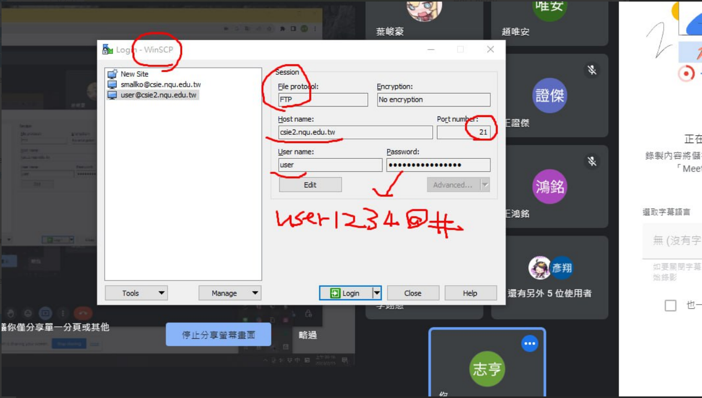

## FTP 

class video

## Cluster

server farm -- many server in this farm

advtg:

* toleration-- even one server is down ,others can still use another server
* performance -- since we have lots of server, each server load is relatively low as well as reponse time

disadvtg:

* Installation -- time consuming => install server at the same time -- Ansible

maintain server  -- monitor (memory usage...  status of each server --  prometheus, kubernetes ), shell script

​	

## IPv6 web

[note/IPv6.md at master · FUYUHSUAN/note (github.com)](https://github.com/FUYUHSUAN/note/blob/master/110-2自動化運維/2022_02_16/IPv6.md)

先測試https://test-ipv6.com/index.html.zh_TW

network -- bridge adpater only this one is enable

inet6 adress start by two zero

## term

SRE -- site reliability engineering

DevOps -- develop operation